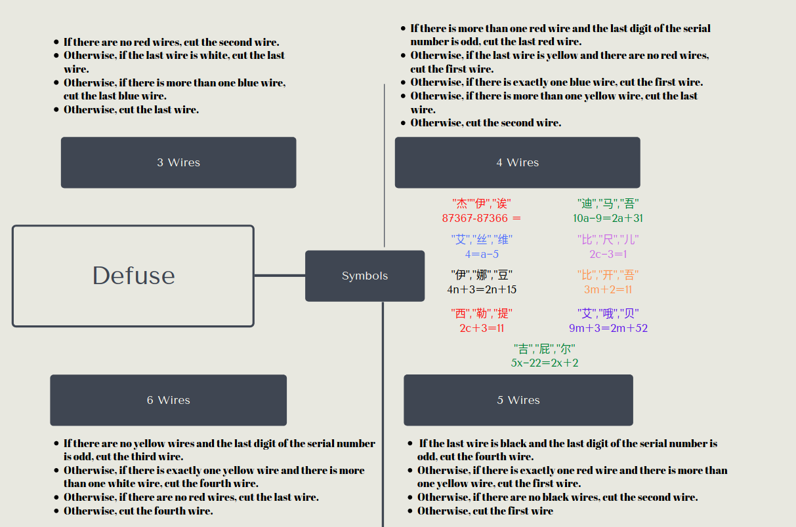

## Bomb Defuse
We have chosen to design a 2D game it’s called “Bomb Defuse ”. This game makes the player think and act under pressure, it tests the players never, The player receives instructions and steps on how to go about defusing the bomb that he gets displayed with. The bomb consists of few steps that are needed to be accomplished before the bomb is defused.

### How to run the game
##### Game Requirements <br>- microphone <br>- keyboard <br>- unity installed

This game is only able to work on a windows computer. The game is only works using the Microsoft Speech engine if you want to use voice, otherwise game is able to work with keyboard controls.

If you do not have unity install:
<br>
**For Windows**
<br>
[Download unity on windows](https://unity3d.com/get-unity/download)
<br>
**For Linux (arch)**
```
sudo pacman -S unityhub 
```

Download the Bomb-Defuse folder and open it with unity. 

### How to play the game
1. Player needs to cut the right wire to unlock the next part of the bomb but every time that the wrong wire is cut the time on
the timer gets decreased by half. User can only make one mistake with the wires.
2. Once the right wire is cut the code that needs decrypting will appear to the user. User needs to follow the bomb manual.
3. When the code is decipher and user has the correct code he enters it and wins the game. If the wrong code is entered the
bomb will explode and ending the game on a defeat
The overall design of the game will be designed by the developers the assets e.g. wires, timers. We will try not to use any assets
from the asset store and make it more difficult for ourselves and give ourselves a bit more work to make it original and make the
game ourself.

### Game Manual 
This game is all about skill and how smart you and your friends are when is comes to working under stressful situations. You must use the Manual to defuse the bomb before the time runs out. 



### Developer Diary
##### Stage 1
First thing we did was make a 3D template for the game and added some instructions to the readme. We got the application up and running in the labs. At this point we were planning on using the Myo armband for our project.
##### Stage 2
We decided to change the project to 2D project for easy of development. We started doing some research on how the game
should run and added some images for the wires.
##### Stage 3
This is where we got the basic mechanics of the game working. So far we had a pin pad working and a bomb scene made. We
then added the wires to the main panel. Found out that merging the files was going to be a big issue for us. We were unable to
use the myo armband because of the poor support on Linux devices. We both were doing working on Linux devices at the time.
In the end we had to give back the armband and think of another way for the user to interact with the game without using a
keyboard or mouse. We wanted the user to still be able to do hand movements.
##### Stage 4
In this stage of development we made a homepage and updated the bomb scene. At this stage we encountered issues when
merging our files on GitHub. We also made a win/lose page for the user and few more updates and buttons. We wanted to use
the Wii controller for the game so the user would have a natural feel when pressing buttons or cutting wires. At the end of this
stage we were unable to get our hands on a Wii controller to due the shops being closed for the pandemic.
##### Stage 5
At this point we decided to finish the game without any gestures and worry about the issue later. There was no other way to get
the game done without the use of hand gestures. We were thinking of using a Xbox Kinect but had no idea where get our hands
on one.
##### Stage 6
We had then decided to use voice controls for the game. We changed our basic Wii designed game over to something we can
use with our keyboard or voice. Once changing everything around we found out that voice input does not work with Linux and
would be easier for us to just find a old windows computer we can just use for testing at home. At this point the college and
country was on a lock down.
##### Stage 7
Got the game working with voice commands on windows computers and made a game manual. The manual explains how the
game works with a keyboard and voice commands you need to do. There were some small errors to fix, which we got done.
When game was completed we started updating the readme and design doc.
 ###### Game by <br> Arkadiusz Mamala <br> Sammar Tahir
